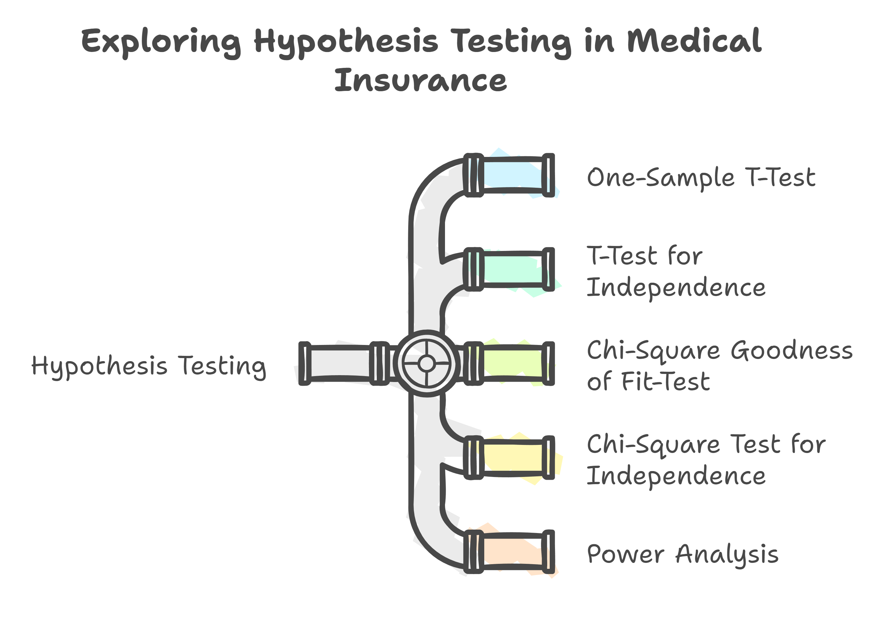

# Hypothesis Testing on Medical Insurance Dataset

A comprehensive statistical analysis project applying hypothesis testing methods to explore relationships and patterns in medical insurance costs. This project demonstrates the use of normality tests, t-tests, chi-square tests, and power analysis to draw evidence-based conclusions from healthcare data.



---

## Table of Contents

- [Overview](#overview)
- [Dataset](#dataset)
- [Statistical Tests](#statistical-tests)
- [Key Findings](#key-findings)
- [Project Structure](#project-structure)
- [Requirements](#requirements)
- [Usage](#usage)

---

## Overview

This project applies statistical hypothesis testing to analyze a medical insurance dataset containing information about patients' demographics, health metrics, and insurance charges. The analysis helps answer critical questions about:

- How BMI affects medical charges
- Whether gender influences insurance-seeking behavior among smokers
- Regional differences in insurance enrollment
- The relationship between BMI category and sex

---

## Dataset

The dataset (`insurance.csv`) contains the following variables:

| Variable | Description |
|----------|-------------|
| `age` | Age of the patient |
| `sex` | Gender (male/female) |
| `bmi` | Body Mass Index |
| `children` | Number of children |
| `smoker` | Smoking status (yes/no) |
| `region` | Geographic region (northeast, northwest, southeast, southwest) |
| `charges` | Medical insurance charges |
| `bmi_category` | Derived category (normal, overweight, obesity) |

---

## Statistical Tests

### 1. Normality Test (Shapiro-Wilk)

**Purpose:** Assess whether data follows a normal distribution before applying parametric tests.

**Method:** Since raw charges were non-normal, we applied:
- **Bootstrapping** (3000 resamples) - Selected as optimal transformation
- Quantile transformation
- Log/Square root transformations
- Box-Cox & Yeo-Johnson transformations

---

### 2. One-Sample T-Test

**Research Question:** Is there a statistically significant difference between the population mean medical charge and sample mean charges for each BMI category?

| Hypothesis | Statement |
|------------|-----------|
| H₀ | No significant difference exists |
| H₁ | Significant difference exists |

**Result:** Reject H₀ - Sample means differ significantly from population mean (p < 0.05)

---

### 3. Two-Sample T-Test (Welch's T-Test)

**Research Question:** Is there a significant difference in medical charges between normal and overweight BMI categories?

| Hypothesis | Statement |
|------------|-----------|
| H₀ | No difference in mean charges between groups |
| H₁ | Significant difference exists |

**Assumptions Checked:**
- Normality (via Shapiro-Wilk on bootstrapped samples) ✓
- Independence ✓
- Equal Variance (Levene's Test) ✗ → Used Welch's T-Test

**Result:** Reject H₀ - Significant difference found (p < 0.001)

**Effect Size:** Cohen's d = 1.28 (Large effect)

**Confidence Interval:** (-67.41, -32.01) - Does not contain 0, confirming significance

---

### 4. Power Analysis

**Purpose:** Determine if sample size is adequate to detect an effect.

| Parameter | Value |
|-----------|-------|
| Effect Size (Cohen's d) | 1.25 |
| Significance Level (α) | 0.05 |
| Desired Power | 0.80 |
| Required Sample Size | ~7 per group |

**Conclusion:** Our actual sample size (1338 records) far exceeds requirements, ensuring robust statistical power.

---

### 5. Chi-Square Goodness of Fit Test

#### Test A: Gender Distribution Among Smokers

**Research Question:** Is gender a significant factor in the distribution of smokers seeking medical insurance?

| Hypothesis | Statement |
|------------|-----------|
| H₀ | Male and female smokers exist in equal proportions |
| H₁ | Proportions differ |

| Observed | Expected |
|----------|----------|
| Male: 159 | 137 |
| Female: 115 | 137 |

**Results:**
- χ² statistic = 7.07
- Critical value (α=0.05, df=1) = 3.84
- p-value = 0.008

**Conclusion:** Reject H₀ - Gender is a significant factor; male smokers outnumber female smokers among insurance seekers.

---

#### Test B: Regional Distribution

**Research Question:** Do patients from different regions have equal likelihood of seeking medical insurance?

| Region | Observed | Expected |
|--------|----------|----------|
| Southeast | 364 | 334 |
| Southwest | 325 | 334 |
| Northwest | 325 | 334 |
| Northeast | 324 | 334 |

**Results:**
- χ² statistic = 3.48
- Critical value (α=0.05, df=3) = 7.81
- p-value = 0.32

**Conclusion:** Fail to reject H₀ - No significant regional differences; patients from all regions seek insurance equally.

---

### 6. Chi-Square Test for Independence

**Research Question:** Is BMI Category independent of sex?

| Hypothesis | Statement |
|------------|-----------|
| H₀ | BMI Category is independent of sex |
| H₁ | BMI Category depends on sex |

**Contingency Table:**

| BMI Category | Female | Male |
|--------------|--------|------|
| Normal | 119 | 108 |
| Obesity | 342 | 374 |
| Overweight | 189 | 186 |

**Results:**
- χ² statistic = 1.74
- Critical value (α=0.05, df=2) = 5.99
- p-value = 0.42

**Conclusion:** Fail to reject H₀ - BMI Category is independent of sex.

---

## Key Findings

| Finding | Statistical Evidence |
|---------|---------------------|
| BMI significantly impacts medical charges | Welch's t-test: p < 0.001, Cohen's d = 1.28 |
| Male smokers seek insurance more than female smokers | χ²(1) = 7.07, p = 0.008 |
| No regional bias in insurance seeking | χ²(3) = 3.48, p = 0.32 |
| BMI category distribution is same across genders | χ²(2) = 1.74, p = 0.42 |
| Sample means differ from population mean | One-sample t-test: p < 0.05 |

---

## Project Structure

```
Hypothesis-Testing-Medical-Insurance-Data/
├── README.md                    # Project documentation
├── insurance.csv                # Dataset
├── 01_Normality_and_T-Test.ipynb    # Normality tests & t-tests
├── 02_Chi_Square_Test.ipynb         # Chi-square analyses
├── statistical_model.ipynb          # OLS regression & diagnostics
├── interaction_plots.ipynb          # Interaction visualizations
├── .assets/                       # Images for documentation
│   ├── infographic.png
│   └── null vs alt.png
└── .gitignore
```

---

## Requirements

```python
pandas
numpy
scipy
statsmodels
scikit-learn
seaborn
matplotlib
jupyter
```

---

## Usage

1. Clone the repository:
   ```bash
   git clone https://github.com/yourusername/Hypothesis-Testing-Medical-Insurance-Data.git
   ```

2. Install dependencies:
   ```bash
   pip install -r requirements.txt
   ```

3. Run the notebooks:
   ```bash
   jupyter notebook 01_Normality_and_T-Test.ipynb
   jupyter notebook 02_Chi_Square_Test.ipynb
   ```

---

## Visualizations

The project includes:
- **QQ Plots** - Assess normality of transformed data
- **Box Plots** - Compare charge distributions across BMI categories
- **Chi-Square Distribution Plots** - Visualize test statistics vs critical values
- **Interaction Plots** - Explore relationships between sex, children, and charges
- **Residual Diagnostic Plots** - Validate OLS regression assumptions

---

## Author

This project demonstrates practical application of statistical hypothesis testing in healthcare analytics, providing evidence-based insights for policy and decision-making.

---

## References

- Shapiro, S. S., & Wilk, M. B. (1965). An analysis of variance test for normality.
- Cohen, J. (1988). Statistical power analysis for the behavioral sciences.
- Statsmodels documentation: https://www.statsmodels.org/
- SciPy stats module: https://docs.scipy.org/doc/scipy/reference/stats.html
